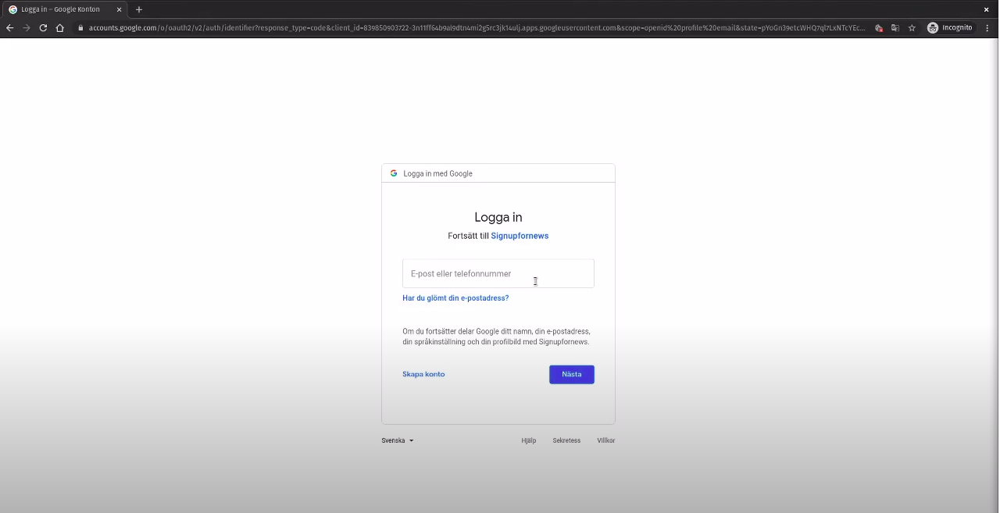
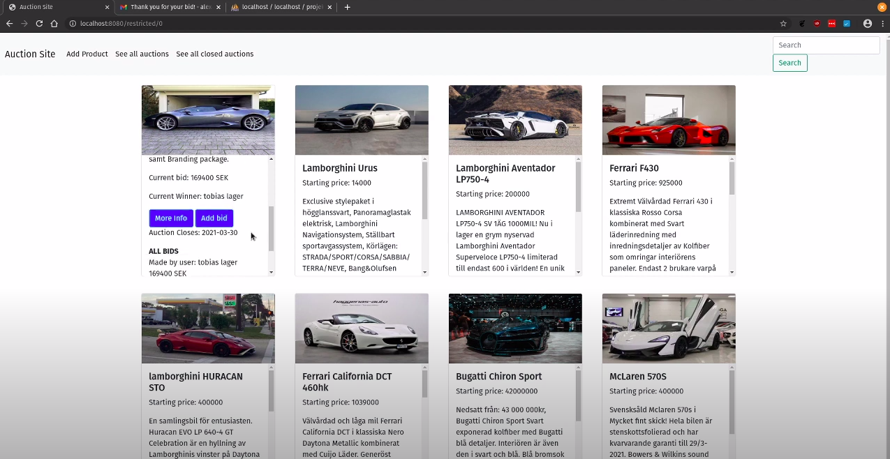
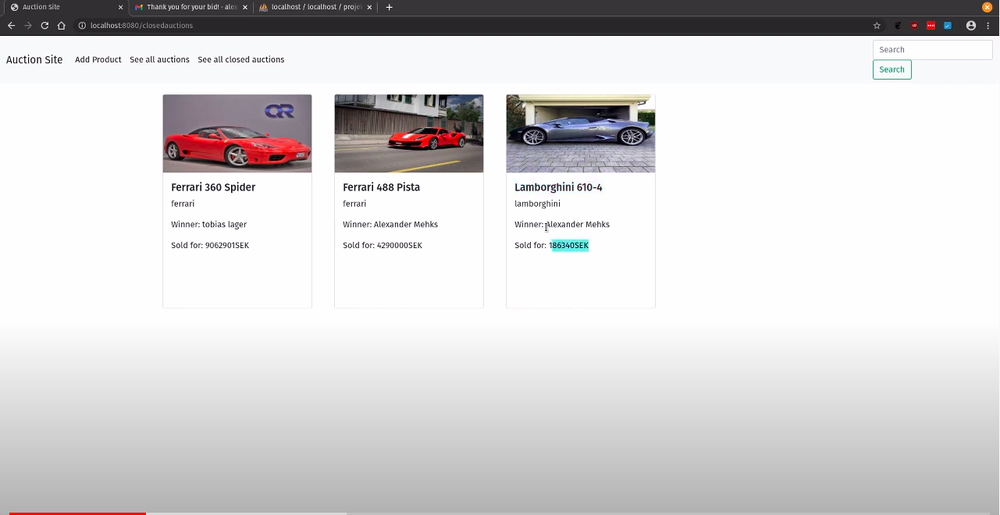
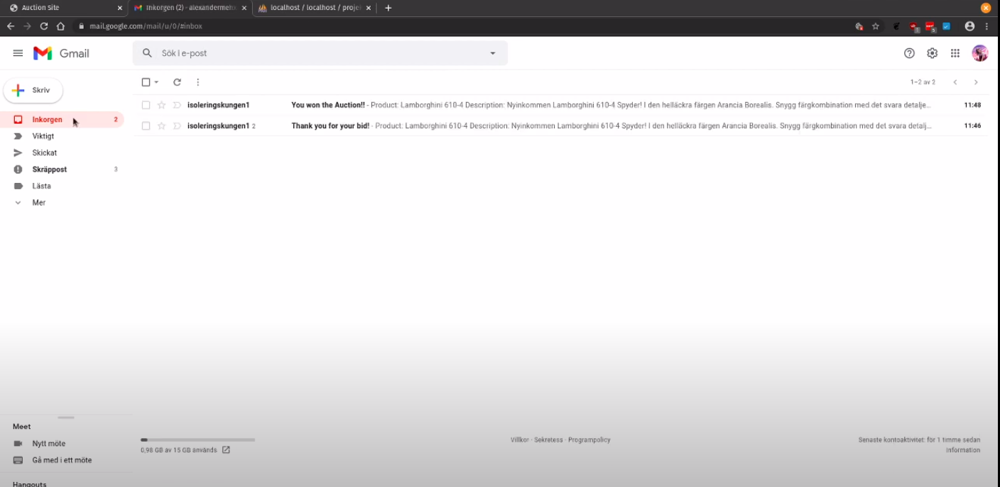

# Car Auction Engine

To run the Auction in VS Code:

1. Download the zipped version or git clone into desired folder.
2. Download JDK11.0.
3. Unzip the JDK into desired folder.
4. Ctrl + P to search --> settings.json
5. Set java.home: "" to the JDK path.
6. Reload the IDE and run the program with the extension Project Manager for Java.

Some extenstion will be needed to install.

Enjoy

# About
  School project to make an Auction Site in Spring Boot Framework. We desired to work with thymeleaf in this project instead of mustache for the frontend.

# Tech/Framework used
Languages + packages:

  

# Preview

